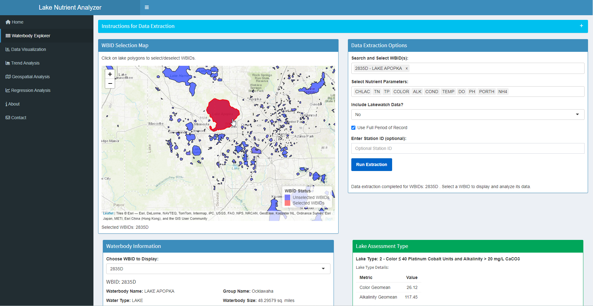

# Florida Lake Nutrient Analyser

[](https://opensource.org/licenses/MIT)


A comprehensive Shiny app designed to analyze nutrient data, assess impairments, and support Total Maximum Daily Load (TMDL) development for Florida lakes. This tool integrates data extraction, statistical analysis, visualization, and geospatial features to assist water quality managers and researchers.



## Features

- **Data Extraction**: Retrieve water quality data by WBID with automated annual geometric mean calculations
- **Impairment Assessment**: Automatically classify lakes and evaluate against Numeric Nutrient Criteria
- **Visualization**: Generate interactive time series, scatter plots, correlation matrices, and nutrient charts
- **Trend Analysis**: Perform Mann-Kendall tests to identify significant water quality trends
- **Geospatial Analysis**: Select and analyze lakes using interactive Leaflet maps
- **Regression Analysis**: Model nutrient relationships and calculate TMDL targets
- **Export Capabilities**: Download data, analysis results, and visualizations in multiple formats

## Demo

Try the [online demo](https://tmdl.shinyapps.io/LakeNutrientAnalyzer/) to see the app in action.

## Prerequisites

- **R**: Version 4.0.0 or higher recommended
- **R Packages**: Install all required packages by running:
  ```r
  source("install_packages.R")
  ```
- **Internet Connection**: Required for loading external JavaScript libraries (PapaParse, xlsx) via CDN

## Installation

1. **Get the Repository**:
   
   **Option A**: Download ZIP file:
   - Click the green "Code" button
   - Select "Download ZIP"
   - Extract the ZIP file to your desired location

   **Option B**: Clone using Git:
   ```
   git clone https://github.com/zaimoua/LakeNutrientAnalyzer.git
   cd LakeNutrientAnalyzer
   ```

2. **Set Working Directory** in R or RStudio:
   ```
   setwd("path/to/LakeNutrientAnalyzer")
   ```

3. **Install Dependencies**:
   ```
   source("install_packages.R")
   ```

## Database Setup

The app requires the `IWR66_database.sqlite` database (from IWR Run 66, the latest update). You have two options:

### Automated Processing

1. First, download the original IWR database files from the [Florida DEP website](https://publicfiles.dep.state.fl.us/dear/IWR/)
2. Run the included database conversion script:
   ```r
   source("install_database.R")
   ```
3. Follow the on-screen prompts to select the downloaded Access files and convert them
4. Make sure the WaterbodyID_Table.csv file is in the data folder for filtering

## Running the App

Launch the app locally by running the `app.R` script:
```r
# In R or RStudio
source("app.R")
```

## Data Requirements

The app relies on specific data files in `data/` and `maps/` folders:

### Included Files
- `data/WaterbodyID_Table.csv`
- `data/Lake_class.csv`
- `data/lake_wbid_region.csv`
- `maps/lake_wbid/lake_wbid.geojson`
- `maps/lake_region/lake_region.geojson`
- `maps/lake_flowline/NHD_flowline_lakes.geojson`

### External File
- `data/IWR66_database.sqlite` (see Database Setup)

## Project Structure

- `ui.R`: Defines the user interface using shinydashboard
- `server.R`: Contains the server logic for data processing and analysis
- `app.R`: Initializes and runs the application
- `install_database.R`: Utility for converting IWR Access databases to SQLite format
- `R/`: Contains helper scripts:
  - `labels.R`: Parameter labels and descriptions
  - `data_extraction.R`: Functions for retrieving data from database
  - `determine_lake_type.R`: Lake classification logic
  - `calculate_exceedances.R`: Numeric nutrient criteria assessment
  - `plot_*.R`: Visualization functions
  - And other utility scripts
- `data/`: CSV files and SQLite database
- `maps/`: GeoJSON files for spatial visualization
- `install_packages.R`: Script to install required R packages
- `.gitignore`: Excludes unnecessary files from version control

## Usage Guide

1. **Select Lake(s)**:
   - Use the interactive map or WBID search in the "Waterbody Explorer" tab
   - Click on waterbodies or search by WBID/name

2. **Extract Data**:
   - Select parameters of interest
   - Choose data period
   - Click "Run Extraction"

3. **Analyze Data**:
   - View lake information and assessment results
   - Explore data through visualizations
   - Perform trend analysis
   - Conduct regression modeling
   - Calculate TMDL targets

4. **Export Results**:
   - Download data tables
   - Export visualizations
   - Generate analysis reports

## Dependencies

Installed via `install_packages.R`:

### Core Shiny
- shiny, shinydashboard, shinyFiles, shinyjs, shinycssloaders

### Visualization
- plotly, ggplot2, leaflet, leaflet.extras, corrplot

### Data Handling
- RSQLite, data.table, tidyverse, dplyr, tidyr, readr, openxlsx, DBI, sf, geojsonio, stringr

### Statistical Analysis
- zoo, Kendall, broom, lmtest, car, nortest, scales

### Utilities
- DT, markdown, waiter, zip, doParallel, logging, futile.logger, rmapshaper, promises, future

## Troubleshooting

- **Missing Data**: Verify all files are in place, especially the SQLite database
- **Package Errors**: Run `install_packages.R` and check the console for any errors
- **Path Errors**: Confirm your working directory is set to the project root
- **Visualization Issues**: Ensure you have an internet connection for external libraries
- **Memory Errors**: Close other applications to free up RAM or increase R's memory allocation

## Contributing

Contributions are welcome! Please feel free to submit a Pull Request or open an Issue for bugs or feature requests.

## License

This project is licensed under the MIT License - see the [LICENSE](LICENSE) file for details.

## Disclaimer

This app was developed by Zaim Ouazzani as a personal project, independent of any affiliation with the Florida Department of Environmental Protection (FDEP). It was shared informally with FDEP staff as a personal endeavor and is not an official FDEP product, nor does it represent the agency’s views, tools, or endorsement. The app uses publicly available Impaired Waters Rule (IWR) data from the Florida DEP, in compliance with the agency’s data usage policy. For official FDEP tools or data, contact the agency at https://floridadep.gov.

## Acknowledgments

- Data from Florida DEP IWR database
- Built with Shiny and R community packages

---

Version: 1.0.0 (Last Updated: May 27, 2025)
