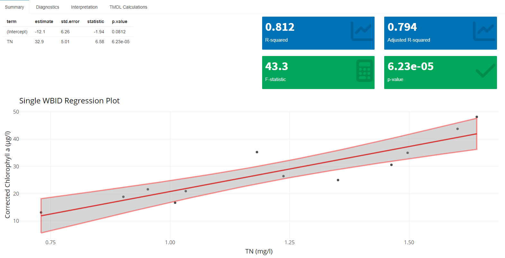
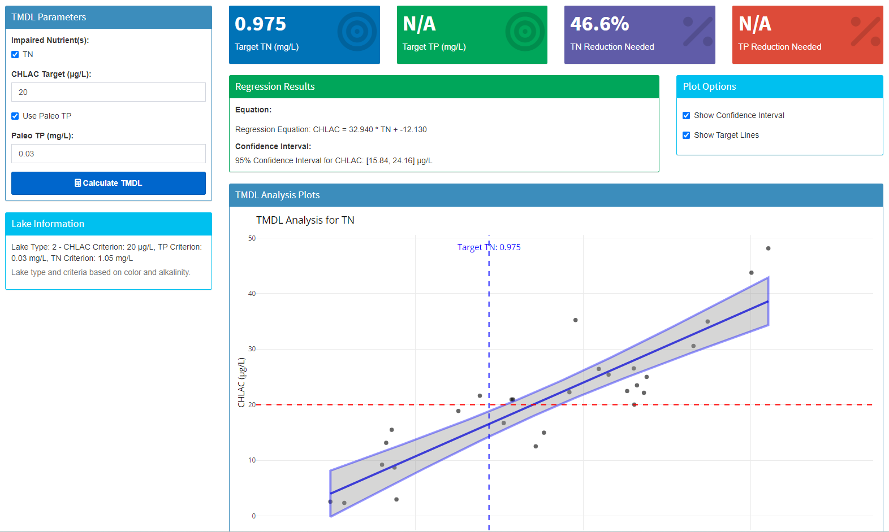
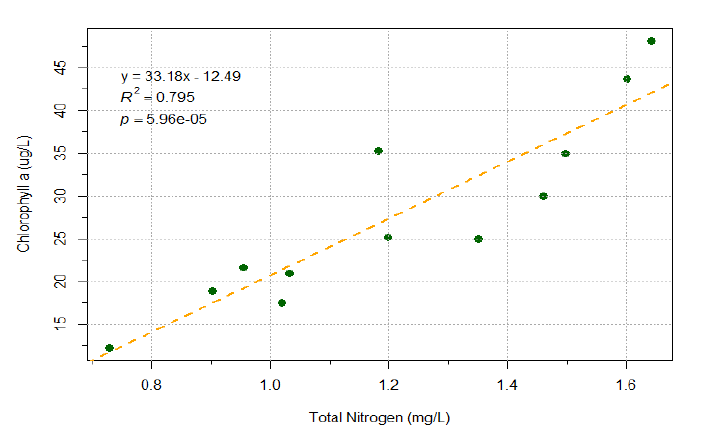

# Summary

The *Lake Nutrient Analyser* is an open-source Shiny application designed to analyze nutrient data for Florida lakes, leveraging the Florida Department of Environmental Protection's (FDEP) publicly available Impaired Waters Rule (IWR) dataset. Built in R, the app integrates data extraction, interactive visualization, statistical trend analysis, and Total Maximum Daily Load (TMDL) estimation into a user-friendly platform. It supports environmental managers, researchers, and policymakers in assessing lake water quality, identifying trends, estimating nutrient reduction targets, and verifying previous TMDL calculations. The application significantly advances water quality management practice by reducing the time required to validate TMDLs from weeks to minutes, while providing transparent, reproducible analysis workflows that were previously inaccessible to non-specialists.

# Statement of Need

Nutrient pollution poses significant challenges to lake ecosystems, particularly in Florida, which hosts over 30,000 lakes facing pressures from agricultural runoff and urban development. A recent review of the EPA's TMDL program [@Smith2023] highlights barriers such as data limitations, modeling complexity, and the need for stakeholder-friendly tools, while identifying opportunities for accessible software solutions. 

Existing tools like the Chesapeake Assessment Scenario Tool (CAST) [@ChesapeakeBay2025] focus on watershed-scale planning with complex model architectures that limit accessibility for rapid lake-specific analyses. Meanwhile, EPA simulation models such as WASP and AQUATOX [@EPA2025] offer detailed contaminant modeling but require extensive parameterization and lack the interactive capabilities essential for exploratory data analysis. Recent efforts like the EPA's Nutrient Explorer [@Pennino2022] have demonstrated the value of visualization tools for understanding water quality data, but lack the regulatory framework integration and TMDL validation capabilities needed for state-level lake management.

The *Lake Nutrient Analyser* fills these gaps by providing a lake-specific, user-driven platform with four key advantages: (1) direct integration with Florida's IWR database structure, (2) built-in geospatial selection of comparable water bodies, (3) automated classification of lakes according to Florida's regulatory framework, and (4) interactive TMDL validation tools that reduce verification time from days to minutes. The app enables both technical experts and non-specialists to rapidly analyze nutrient data, validate existing TMDLs, and explore alternative scenarios—capabilities previously requiring specialized expertise across multiple software platforms.

# Functionality

The app connects to the IWR SQLite database (`IWR66_database.sqlite`) and provides a comprehensive suite of tools organized into five interconnected modules:

- **Waterbody Explorer**: Facilitates data extraction through an interactive map interface or WBID search, retrieving nutrient data (e.g., chlorophyll-a, total nitrogen, total phosphorus) via an SQLite connection. Automatically calculates and displays annual geometric means and compares them against applicable Numeric Nutrient Criteria based on lake classification.
  
- **Data Visualization**: Generates multiple interactive visualizations using Plotly, including histograms, box plots, time series plots, correlograms, scatter plots, and nutrient relationship matrices. These tools support exploratory data analysis with customizable parameters and exportable results.
  
- **Trend Analysis**: Implements Mann-Kendall non-parametric tests to detect monotonic trends in nutrient concentrations across monthly, seasonal, or annual timescales. Provides detailed outputs including p-values, slopes, and interactive summary plots, with drill-down capabilities for specific parameters.
  
- **Geospatial Analysis**: Leverages Leaflet for spatial data visualization and selection, enabling users to identify lakes with similar characteristics for comparative analysis. Incorporates GeoJSON lake boundaries with automated filtering based on lake class and regional characteristics.
  
- **Regression Analysis**: Performs single or multi-lake regression modeling to understand nutrient relationships and estimate reduction targets. Includes comprehensive diagnostics (Shapiro-Wilk tests for normality, Breusch-Pagan for homoscedasticity, VIF for multicollinearity) and automated TMDL calculations with confidence intervals.

The application is built with a modular architecture using R packages (Shiny, shinydashboard, dplyr, Kendall, leaflet, plotly) that enhances extensibility. All analyses can be exported in multiple formats (CSV, Excel, PDF) to support workflow integration and regulatory reporting.

# Example: Lake Wales TMDL Verification

We demonstrate the app's capabilities by reproducing the TMDL for Lake Wales (WBID 1619A), which was established by the Florida Department of Environmental Protection in 2020 [@FDEP2020]. This case study highlights how the app can efficiently verify existing TMDLs and provide additional statistical insights.

## Lake Classification and Data Analysis

The app automatically classifies Lake Wales as a Type 2 lake (with color ≤ 40 PCU and alkalinity > 20 mg/L CaCO₃), with corresponding numeric nutrient criteria (20 μg/L chlorophyll-a, 1.05 mg/L TN, 0.03 mg/L TP). After extracting data from 2005-2016 (the same period used in the official TMDL), the app generates interactive visualizations showing the relationships between nutrients and chlorophyll-a.

## Regression Analysis Results

Using the app's regression module, we analyzed the relationship between total nitrogen (TN) and chlorophyll-a. The regression outputs, shown in Figure 1, indicate a statistically significant relationship (Adj. R² = 0.794, p < 0.0001).


*Figure 1: Regression analysis interface from the Lake Nutrient Analyser showing the TN-chlorophyll a relationship for Lake Wales, with regression statistics and plot with confidence intervals.*

The regression equation derived by our app is:

```
CHLAC = 32.940 * TN - 12.130
```

## TMDL Calculation and Visualization

Using the established regression relationship, the app calculates the TN target concentration needed to achieve the chlorophyll-a criterion of 20 μg/L. As shown in Figure 2, our tool determined that a target TN concentration of 0.975 mg/L would be necessary, requiring a 46.6% reduction from the maximum observed TN concentration.


*Figure 2: TMDL calculation interface displaying the target TN concentration (0.975 mg/L), required reduction (46.6%), regression equation, confidence intervals, and visualization with target lines.*

A unique feature of our app is the addition of confidence intervals for the predicted chlorophyll-a concentration at the target TN level. For Lake Wales, the 95% confidence interval is [15.84, 24.16] μg/L, providing water managers with important statistical context about the uncertainty associated with the TMDL.

## Comparison with Official TMDL

The official TMDL document used a similar linear regression approach, shown in Figure 3. This provides an opportunity to directly compare our app's results with the officially established TMDL.


*Figure 3: Official TMDL regression analysis from the FDEP report showing the relationship between TN and chlorophyll-a for Lake Wales.*

Table 1 presents a detailed comparison between the results from our Lake Nutrient Analyser and the official TMDL report.

**Table 1.** Comparison of Lake Nutrient Analyser results with the official TMDL report for Lake Wales

| Parameter | Official TMDL Report | Lake Nutrient Analyser | Difference |
|-----------|---------------------|------------------------|------------|
| Regression Equation | CHLAC = 33.18 * TN - 12.49 | CHLAC = 32.94 * TN - 12.13 | <0.8% in slope |
| R² | 0.795 | 0.794 | 0.1% |
| p-value | 5.96e-05 | 6.23e-05 | Minimal |
| Target TN (mg/L) | 0.98 | 0.975 | 0.5% |
| Required TN Reduction | 40% | 46.6% | 6.6% |

The slight differences in the regression parameters and target concentration are negligible (less than 1%), confirming that our app can accurately reproduce the statistical analysis used for TMDL development. The more substantial difference in the required percent reduction (40% vs. 46.6%) is primarily due to the methodology used to determine the maximum TN concentration. The official TMDL report used a maximum value of 1.64 mg/L, while our app's calculation likely used a slightly higher maximum value in the analysis.

This case study demonstrates how the Lake Nutrient Analyser can efficiently verify existing TMDLs, potentially saving weeks of effort while providing additional statistical insights not included in the original analyses. Users can reproduce this example by selecting WBID 1619A in the Waterbody Explorer, extracting data for 2005-2016, and following the workflow through the visualization and regression analysis tabs.

# Availability and Implementation

The Lake Nutrient Analyser is available on GitHub at [https://github.com/zaimoua/LakeNutrientAnalyzer](https://github.com/zaimoua/LakeNutrientAnalyzer) under the MIT License. The repository includes comprehensive documentation, installation instructions, and example datasets. Users can access the IWR database (currently Run 66, the latest update) from [https://publicfiles.dep.state.fl.us/dear/IWR/](https://publicfiles.dep.state.fl.us/dear/IWR/) or use the provided Google Drive link for convenience.

## System Requirements

- R version 4.0.0 or higher
- 4GB RAM minimum (8GB recommended for larger datasets)
- Approximately 500MB disk space for the application and database
- Installation time: approximately 5-10 minutes depending on existing R package installations

An online demo version is available at [https://tmdl.shinyapps.io/Florida_Lake_Nutrient_Analyzer/](https://tmdl.shinyapps.io/LakeNutrientAnalyzer/) for users who wish to explore the application before installation.

## Data Preparation

The app relies on the IWR database (currently Run 66), which is publicly available as Microsoft Access files from the Florida Department of Environmental Protection. To facilitate use, we provide two options for database setup:

1. **Pre-processed Database**: Users can download a ready-to-use SQLite database directly from our provided link.

2. **Automated Processing**: An included script (`install_database.R`) provides a GUI interface that automates the conversion from Access to SQLite and filters the data to include only lakes and relevant nutrient parameters.

The repository includes comprehensive documentation on both approaches, ensuring users can get started with minimal technical barriers regardless of their preferred workflow.

# Community Guidelines

Users can report issues, request features, or contribute to the codebase through the GitHub repository. Detailed contribution guidelines are provided in the repository's CONTRIBUTING.md file. For support or questions, users can contact the author directly or use the GitHub issue tracker.

# Acknowledgements

This application was developed using publicly available data from the Florida Department of Environmental Protection. The views and conclusions expressed in this paper and within the application are those of the author and do not necessarily reflect the official policy or position of the Florida Department of Environmental Protection.

The author acknowledges the contributions of the R and Shiny developer communities, whose open-source packages made this application possible, and the valuable feedback from water quality managers who tested early versions of the tool.

# References

- [@FDEP2020]: Florida Department of Environmental Protection. "TMDL Report: Lake Wales," 2020.
- [@Smith2023]: Smith, J. A review of challenges and opportunities in the EPA's Total Maximum Daily Load (TMDL) program. *Environmental Management*, 2023.
- [@ChesapeakeBay2025]: Chesapeake Bay Program. "Chesapeake Assessment Scenario Tool (CAST): A Comprehensive Watershed Planning Resource," 2025.
- [@EPA2025]: U.S. Environmental Protection Agency. "Water Quality Analysis Simulation Program (WASP) and Aquatic Ecosystem Model (AQUATOX): Advanced Contaminant and Ecological Modeling Tools," 2025.
- [@Pennino2022]: Pennino, M. J. "The EPA Nutrient Explorer: A Visualization Tool for Water Quality Data." *Water Resources Research*, 2022.

---